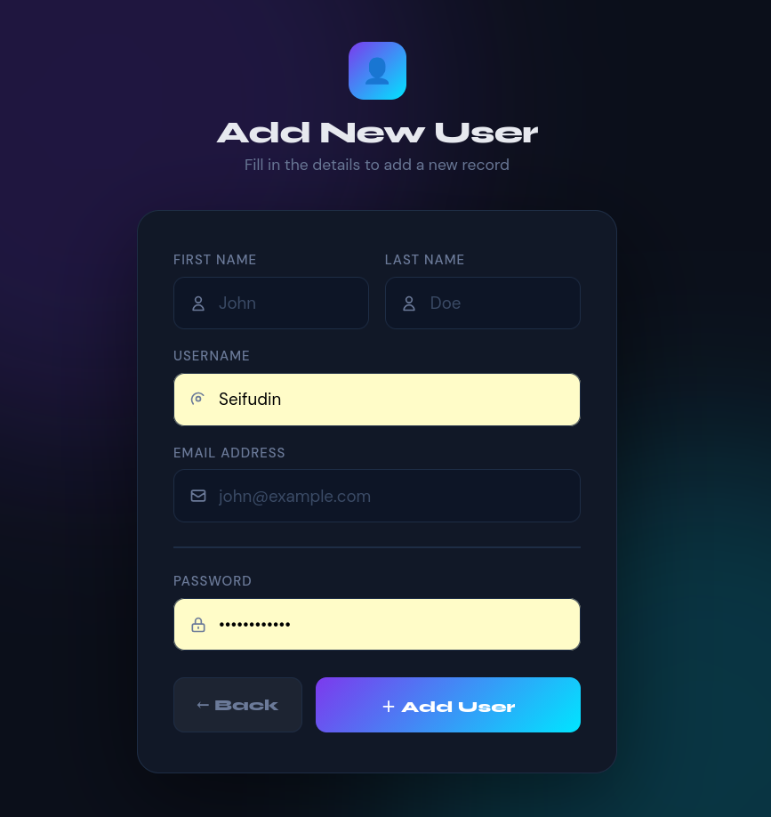

# 🎉 Registration Form - My First PHP Project!

## Overview

I'm thrilled to present my first PHP learning project! This is a full-featured **User Registration System** with a modern, sleek dark-themed interface. It demonstrates my journey into PHP development and database management with a fully functional CRUD application.

## What I Built 🚀

A complete user management system where I can:
- ✅ **Create** - Add new users with their details
- ✅ **Read** - View all registered users in a beautiful table
- ✅ **Update** - Edit existing user information
- ✅ **Delete** - Remove users from the system

## Key Features

### 🎨 **Modern UI Design**
- Beautiful dark theme with gradient backgrounds
- Smooth animations and hover effects
- Responsive design for all screen sizes
- Clean, intuitive user interface

### 🔒 **Secure Authentication**
- Password hashing using MD5 encryption
- Form validation and error handling
- MySQL database integration

### 💾 **Database Management**
- MySQL database storage
- Efficient data retrieval and manipulation
- User information organization

## Project Structure

```
RegistrationForm/
├── index.php        # Add new user form
├── view.php         # Display all users
├── edit.php         # Edit user information
├── delete.php       # Delete user records
└── image.png        # UI preview screenshot
```

## Technology Stack

- **Backend:** PHP
- **Database:** MySQL
- **Frontend:** HTML, CSS, JavaScript
- **Server:** Apache (XAMPP)

## How It Works

### Adding a New User
Fill in the registration form with the required details (First Name, Last Name, Username, Email, Password) and click "Add User". The data is securely stored in the MySQL database.

### Viewing Users
All registered users are displayed in a clean, organized table view with options to edit or delete each record.

### Editing & Deleting
Each user entry can be modified or removed with simple button clicks.

## Preview


*Beautiful registration form with modern dark theme interface*

## What I Learned 📚

This project was an amazing first step in my PHP learning journey:
- Working with form submissions (`POST` requests)
- Connecting to MySQL databases with MySQLi
- Executing SQL queries (INSERT, SELECT, UPDATE, DELETE)
- Error handling and user feedback
- HTML/CSS for responsive design
- Security basics (password hashing, form validation)

## Database Setup

To use this project, create a MySQL database called `userdetailsDB` with a table `userstable`:

```sql
CREATE TABLE userstable (
  id INT AUTO_INCREMENT PRIMARY KEY,
  firstname VARCHAR(50),
  lastname VARCHAR(50),
  username VARCHAR(50),
  email VARCHAR(100),
  password VARCHAR(255)
);
```

## Getting Started

1. Place files in your `htdocs` folder
2. Start Apache and MySQL via XAMPP
3. Navigate to `localhost/RegistrationForm/`
4. Start managing users!

---

**🌟 I'm proud of this achievement - my first PHP project! Here's to learning, growing, and building awesome things!**
